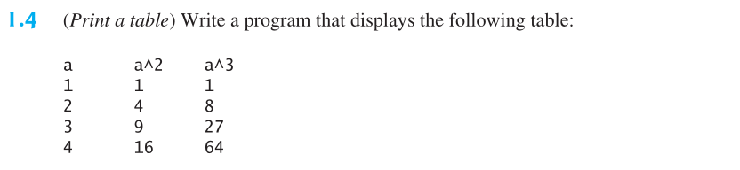
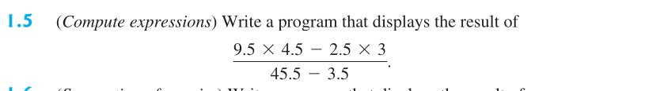
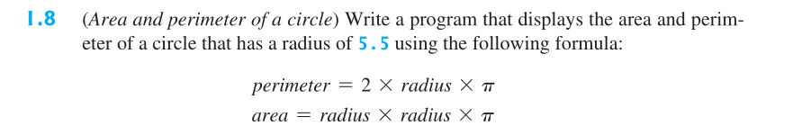
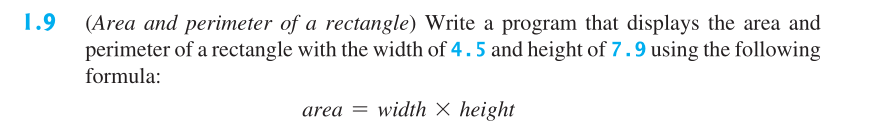
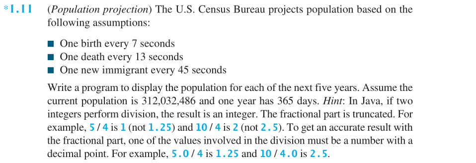
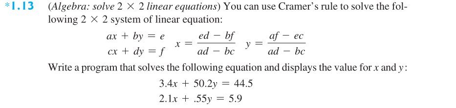

The `problems` directory contains Java programs for solving various problems:

- [1.1 DisplayThreeMessages.java](problems/DisplayThreeMessages.java): Program to display three messages.

- [1.2 DisplayFiveMessages.java](problems/DisplayFiveMessages.java): Program to display five messages.

- [1.3 DisplayPattern.java](problems/DisplayPattern.java): Program to display a pattern.

- [1.4 PrintTable.java](problems/PrintTable.java): Program to print a table.

- [1.5 ComputeExpression.java](problems/ComputeExpression.java): Program to compute a mathematical expression.

- [1.6 SummationOfSeries.java](problems/SummationOfSeries.java): Program to calculate the summation of a series.

- [1.7 ApproximaterPi.java](problems/ApproximaterPi.java): Program to approximate the value of Pi.

- [1.8 AreaPerimeterOfCircle.java](problems/AreaPerimeterOfCircle.java): Program to calculate the area and perimeter of a circle.

- [1.9 AreaPerimeterOfRectangle.java](problems/AreaPerimeterOfRectangle.java): Program to calculate the area and perimeter of a rectangle.

- [1.10 AverageSpeedInMiles.java](problems/AverageSpeedInMiles.java): Program to calculate average speed in miles.

- [1.11 PopulationProject.java](problems/PopulationProject.java): Program to project population growth.

- [1.12 AverageSpeedInKilometers.java](problems/AverageSpeedInKilometers.java): Program to calculate average speed in kilometers.

- [1.13 SimultaneousUsingCramerRule.java](problems/SimultaneousUsingCramerRule.java): Program to solve simultaneous equations using Cramer's
